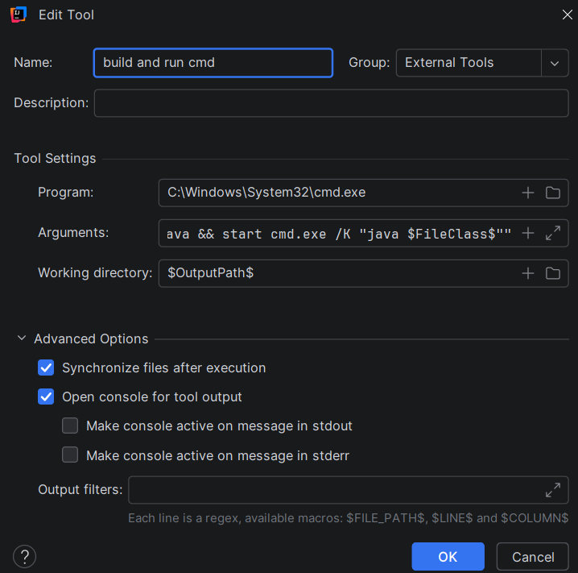
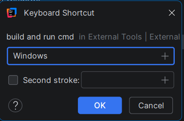

# Sudoku-Geemu-Pet
Juego de sudoku con implementacion de sistema de cuidado de mascota virtual. Codigo basado en Java

Se ha buscado una manera diferente de presentar nuestro juego que no es solo un juego, es una manera de captar la atención del usuario y que se sienta incentivado a continuar para cuidar de la mascota que le acompañara. Además como uno de nuestros miembros no es conocedor del juego, tambien se implemento un sistema que ayuda a desarrollar a lo largo.

Desde correciones de errores al insertar o pistas de tu compañero.

Por ultimo tenemos tres niveles de dificultad, continuacion del último nivel jugado, cuidado de hambre, felicidad, salud y energia de tu compañero.

si bien funciona de manera satisfactoria en una depuracion del mismo aplicativo usado (intelliJ IDEA), puede acceder al mismo por medio de cmd para una mejor experiencia

*paso 1*    
acceder a configuración

*paso 2*  
acceder a herramientas (tools)

*paso 3*  
acceder a herramientas externas

*paso 4*  
Una vez este aqui, agregue una nueva. De esta debera agregar una nueva herramienta

de esta insertar en la parte de argumentos:

/C "javac -d $OutputPath$ $FileDir$\*.java && start cmd.exe /K "java $FileClass$""

y en la parte de working directory
$OutputPath$

*paso 5*
Una vez realizados los pasos anteriores, la manera de acceder a estos será:
keymap -> external tools -> seleccionar la herramienta creada

esto le aparecera que seleccione un boton de acceso, seleccionara el de su preferencia
- como sugerencia evite aquellos botones que ya tienen alguna funcionalidad

¡Eso seria todo, disfruten del juego!
-